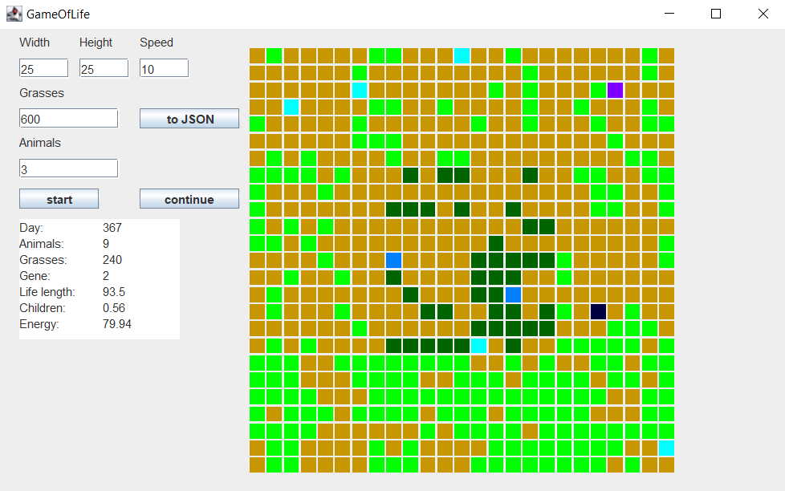

# GameOfLife

This simulation aims to show the evolution of animals. 

## Description of experiment

The animals at the beginning of the game are represented as celadon squares, if they are 'full' (have a lot of energy) they change their color to a darker one.

The general rules are as follows 
1. If the energy is below 0 - animal dies
2. If the animal _eats_, it increases its own energy
3. Grass spawns in a random place on the map at certain times
4. If the animals have enough energy and are close to each other, they can create a new pet

On the overview picture you can see small grass fields (counts as 1) as light green squares, large grass fields (counts as 2) as dark green squares. 

## Buttons

The user can specify the size of the map and the number of animals, grass fields and the speed of the simulation. In addition, it can save the results of experiments in a JSON file.

